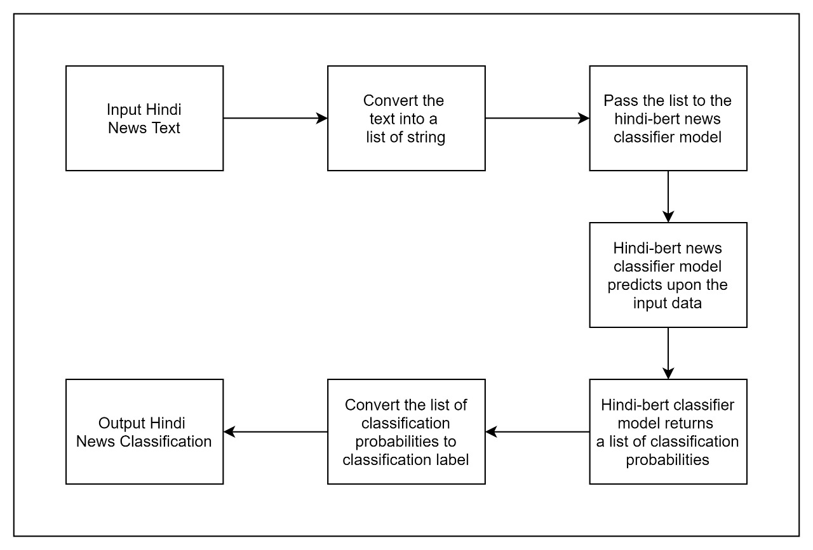

# **Classification Of Hindi News**
Classification Of Hindi News (COHN), this application uses the monsoon-nlp/hindi-bert 
model and attempts to use transfer learning on the model to classify a set of Hindi news 
snippets into its respective predefined categories. 

This project was made in collaboration with:

- [Daniel Lobo](https://github.com/danlobo1999)
- [Jenny Dcruz](https://github.com/jendcruz22)
- [Smita Deulkar](https://github.com/smita3199)
- [Leander Fernandes](https://github.com/fernandeslder)

## **Table of Contents:**
1. <a href="#About">About</a>
2. <a href="#FS">Folder Structure</a>
3. <a href="#Inst">Installation</a>
4. <a href="#AppRun">How to run the application?</a>
5. <a href="#WW">What's what?</a>
6. <a href="#Demo">Demonstration</a>
7. <a href="#References">References</a>

---

## <a name="About">**1. About**</a>
In today’s era, when everything is going digital there is a large amount of data available. 
One of the versatile forms of data is news. The news is spread widely due to technological advancements 
and it influences people to a great extent. The news classification is an important aspect when there is a 
processing of news information, it can help distinguish news according to its category and even help to organize. 
It is even helpful for preference or relevance. In this project, a Hindi News Classification model is proposed, 
which uses the [monsoon-nlp/hindi-bert model](https://huggingface.co/monsoon-nlp/hindi-bert) and attempts to use transfer 
learning on the model to classify a set of Hindi news snippets into its respective predefined categories. Such text 
classification becomes challenging in Hindi due to its large set of available conjuncts and letter combinations, its 
sentence structure, and multisense words. We used [BBC Hindi News Dataset](https://github.com/NirantK/hindi2vec/releases/tag/bbc-hindi-v0.1) 
to train the model and gained an accuracy of 63.47%.

<p align="center">
    
</p>

## <a name="FS">**2. Folder Structure</a>**
```
classification-of-hindi-news
├───dataset
├───flask-app
│   ├───static
│   │   ├───css
│   │   ├───img
│   │   ├───js
│   │   └───vendor
│   └───templates
├───hindibert
├───model
│   └───hindi_bert_model
└───tests
```

## <a name="Inst">**3. Installation**</a>
Clone the repository. Before installing the requirements, create a python or conda environment. An environment is a tool that helps you keep dependencies required by different projects separate by creating isolated virtual environments for them.

### **3.1 Creating a Python environment:**

Open your terminal and install the virtual environment tool with pip as follows :
```
pip install virtualenv
```
After the virtualenv has been installed, cd to the folder where you've saved this application from the terminal and run the following command to create a virtual environment :

```
cd path_to_folder
virtualenv -p python3.7.10 env_name
```

Activate your environment : 
```
env_name\Scripts\activate
```

### **3.2 Creating a conda environment :**

Open your Anaconda prompt (You can also use miniconda). Create a conda environment using the following command :
```
conda create -n env_name python=3.7.10 anaconda
```

After successfully creating your environment, activate it by running :
```
conda activate env_name
```


Once you have created an environment using either one of the above methods, install the application's requirements :
```
pip install -r requirements.txt
```

## <a name="AppRun">**4. How to run the application?**</a>
Open your terminal, activate your python/conda environment, change directory to [flask-app](https://github.com/danlobo1999/classification-of-hindi-news/tree/development/flask-app) and run the [app.py](https://github.com/danlobo1999/classification-of-hindi-news/blob/development/flask-app/app.py) file using the following command :
```
python app.py
```
or
```
flask run
```

## <a name="WW">**5. What's what?**</a>

* This application uses Flask, HTML, CSS, JavaScript, JQuery, and Ajax. 

* The [app.py](https://github.com/danlobo1999/classification-of-hindi-news/blob/development/flask-app/app.py) file consists of the flask application. 

* This flask application uses various templates that are created using HTML and are stored in the [templates](https://github.com/danlobo1999/classification-of-hindi-news/tree/development/flask-app/templates) folder.

* The [CSS](https://github.com/danlobo1999/classification-of-hindi-news/tree/development/flask-app/static/css) and [JavaScript](https://github.com/danlobo1999/classification-of-hindi-news/tree/development/flask-app/static/js) files used by the HTML templates are stored in the [static](https://github.com/danlobo1999/classification-of-hindi-news/tree/development/flask-app/static) folder. 

* The main page ie the [index.html](https://github.com/danlobo1999/classification-of-hindi-news/blob/development/flask-app/templates/index.html) file consists of the basic details of this application: How it works, about the system, the system, about the team, etc.

* The [hindibert](https://github.com/danlobo1999/classification-of-hindi-news/tree/development/hindibert) folder consists of the python source code required to run  the application and the [model](https://github.com/danlobo1999/classification-of-hindi-news/tree/development/model) folder contains our Hindi BERT model which is trained on our [dataset](https://github.com/danlobo1999/classification-of-hindi-news/tree/development/dataset).


* The [notebooks folder]() consists of various notebooks for data exploration, training and testing the Hindi BERT model. 

## <a name="Demo">**6. Demonstration**</a>

Click on the GIF to watch the demonstration video.
[](https://www.youtube.com/watch?v=NiI6iSWUnWg)

---


## <a name="References">**7. References:**</a>

[1] [Hindi BERT model](https://huggingface.co/monsoon-nlp/hindi-bert)

[2] [BBC Hindi News Dataset](https://github.com/NirantK/hindi2vec/releases/tag/bbc-hindi-v0.1)

[3] [Deep Learning for Hindi Text Classification: A Comparison](https://www.researchgate.net/publication/338883896_Deep_Learning_for_Hindi_Text_Classification_A_Comparison)

